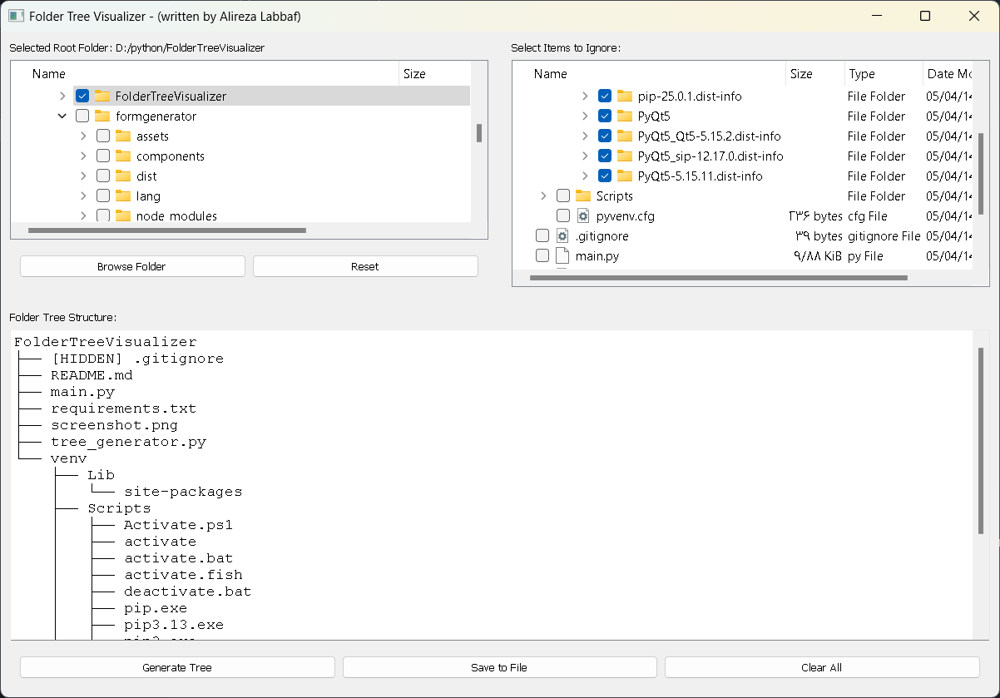

# 📁 FolderTreeVisualizer

**FolderTreeVisualizer** یک ابزار گرافیکی ساده و کاربردی با استفاده از PyQt5 است که به شما اجازه می‌دهد ساختار پوشه‌ها و فایل‌های یک مسیر خاص را به صورت درختی مشاهده، فیلتر و ذخیره کنید. این برنامه برای توسعه‌دهندگان، مدیران سیستم، و هر کسی که نیاز به مرور سریع ساختار دایرکتوری دارد مفید است.

---

## 🛠 ویژگی‌ها

- انتخاب پوشه‌ی ریشه با مرورگر گرافیکی
- نمایش ساختار درختی پوشه‌ها و فایل‌ها
- امکان انتخاب پوشه‌ها و فایل‌های خاص برای نادیده گرفتن (ignore)
- تولید نمای درختی متنی (مانند `tree`)
- ذخیره‌ی خروجی ساختار درختی به فایل متنی
- رابط کاربری ساده، واکنش‌گرا و زیبا با استفاده از Qt

---

## 🖼 تصویر محیط برنامه



---

## 🚀 نحوه‌ی اجرا

### 1. کلون کردن پروژه

```bash
git clone https://github.com/your-username/FolderTreeVisualizer.git
cd FolderTreeVisualizer
```

### 2. ایجاد محیط مجازی (اختیاری ولی پیشنهاد شده)

```bash
python -m venv venv
source venv/bin/activate     # لینوکس / مک
venv\Scripts\activate      # ویندوز
```

### 3. نصب وابستگی‌ها

```bash
pip install -r requirements.txt
```

### 4. اجرای برنامه

```bash
python app.py
```

---

## 💾 ساختار پروژه

```
FolderTreeVisualizer/
├── app.py                  # فایل اصلی اجرای GUI
├── tree_generator.py       # کلاس مسئول تولید ساختار درختی
├── requirements.txt        # وابستگی‌های پروژه
├── screenshot.png          # تصویر محیط برنامه
└── venv/                   # محیط مجازی (در .gitignore قرار گیرد)
```

---

## 📌 نکات

- فایل‌های و پوشه‌هایی که با `.` شروع می‌شوند، در نمایش درختی به صورت `[HIDDEN] filename` مشخص می‌شوند.
- بخش "Ignore" از پوشه‌ی انتخاب‌شده ریشه می‌گیرد و به شما امکان می‌دهد پوشه‌ها یا فایل‌هایی را از نمایش نهایی حذف کنید.

---

## 🧑‍💻 توسعه‌دهنده

علیرضا لباف  
📧 Email: [alirezalf@gmail.com](mailto:alirezalf@gmail.com)  
📱 Tel: 09196600545

---

## 📝 لایسنس

این پروژه به صورت آزاد و منبع‌باز توسعه یافته و می‌توانید آن را بر اساس نیازهای خود گسترش دهید یا تغییر دهید.

---

## 🙏 حمایت

اگر این پروژه برایتان مفید بود، لطفاً آن را در GitHub ستاره‌دار ⭐ کنید یا با سایر علاقه‌مندان به اشتراک بگذارید.
